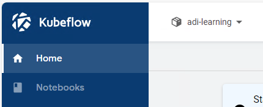

## AVD

The Advanced Analytics Workspace (AAW) runs in the cloud and it's main interface is called Kubeflow. In order to access the AAW, please launch your AVD using the **Remote Desktop** icon on your personal computer.

Once your AVD has started, you can launch the AAW by opening the icon on your desktop. You can also access the AAW by following this link: [https://kubeflow.aaw.cloud.statcan.ca/](https://kubeflow.aaw.cloud.statcan.ca/).

### Login with Your Statistics Canada Account

You'll need to login using your Statistics Canada account.

# Using the AAW through the Kubeflow Interface

## Kubeflow Central Dashboard

When you first log in to the AAW, you will see the Kubeflow Central Dashboard. This contains links to recently used Notebook Servers and documentation.

## Kubeflow Central Dashboard Sidebar

The sidebar on the left has 

- **Home**: The Kubeflow Central Dashboard.
- **Notebooks**: Manage your notebook servers.
- **Metrics**: Grafana, the AAW's observability platform.
- **Github**: The official Kubeflow Github repository.
- **Documentation**: The official Kubeflow documentation.

As a user of the Advanced Analytics Workspace, you'll only need to use **Home** and **Notebooks**.

## Namespace Selection

When you are on the Kubeflow Central Dashboard, in the upper left corner you will find the **Select namespace** dropdown menu. If the menu says "Select namespace" then you need to select a namespace before you can view, edit or launch any of your notebook servers. 

### Select the namespace from the namespace dropdown menu.

When you select the menu, a dropdown list will appear with all the namespaces you belong to. Please select the appropriate namespace before moving forward.

### If you see the name of a namespace, you are ready to use the AAW.

Once a namespace has been selected, the name of the namespace will replace "Select namespace". If no namespaces appear in the menu, please contact us on [Jira](https://jirab.statcan.ca/projects/BTIS/issues).

# Creating a new Notebook Server

## Click **Notebooks** from the sidebar on the left.

Once you click **Notebooks** from the Central Dashboard Sidebar, you will be brought to the Notebooks management section of Kubeflow where you can **Create**, **Start**, **Stop** and **Delete** your notebook servers and storage.

**Note**:  only one set of notebook servers can be viewed at a time. If you have more than one namespace. You may need to select the appropriate namespace from the **Select namespace** dropdown menu in the upper left-hand corner to see the notebook servers belonging to that particular namespace. 

## Click **"+ New Notebook"**

To create a new notebook server, press the **"+ New Notebook"** button in the upper right-hand corner.

# Configure the Notebook Server

## Name your notebook server

The first thing you'll have to do is to name your Notebook Server. You must start the name with a lowercase letter and no spaces.

## Select the notebook server type.

The SAS image will be most appropriate for most users. If you don't need access to SAS, then the JupyterLab image is a lighter alternative. The RStudio image only has RStudio so if you only ever want to use RStudio that image may suite your needs well. The Ubuntu image is a more advanced desktop image for special desktop applications.

### JupyterLab

If you don't need access to SAS, then the JupyterLab image is a lighter alternative. The JupyterLab image contains environments for working with R, Python and Julia. 

#### Features

The JupterLab Notebook Server has the following features:

- Python
- R
- Julia
- Pluto
- OpenM++
- VS Code

#### Screenshot

Interactive sessions can be started by clicking on any of the icons in the Launcher as seen in the screenshot below.

### RStudio

#### Features

The RStudio image only has RStudio so if you only ever want to use RStudio that image may suite your needs well. We include some packages by default:

- Tidyverse
- Tidymodels
- Caret
- Quarto

#### Screenshot

### Ubuntu

The Ubuntu image is a more advanced desktop image for special desktop applications.

#### Screenshot

### SAS

The SAS image will be most appropriate for most users.

#### Screenshot

Interactive sessions can be started by clicking on any of the icons in the Launcher as seen in the screenshot below.

## Select Protected B if you need it

Select Protected B if you need it. Your notebook server will not have access to the internet if you do this.

Once your notebook server has been named and you have selected the type of notebook server you can press **LAUNCH**.

