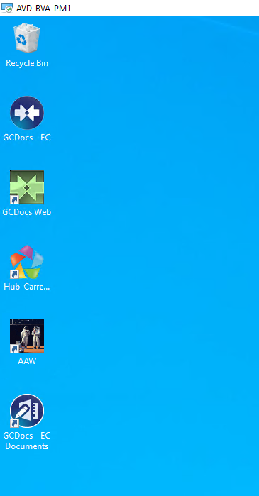
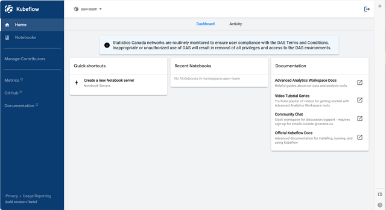
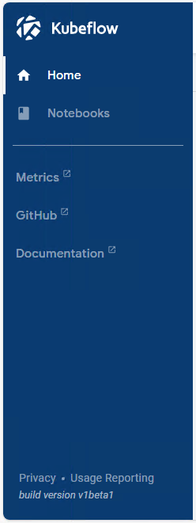
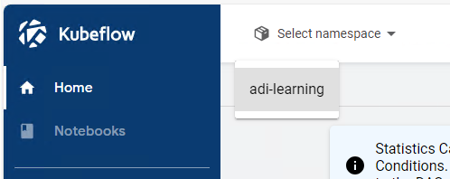
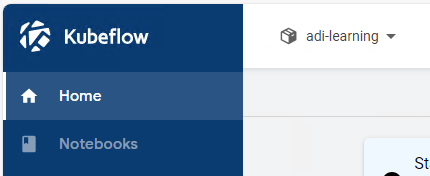
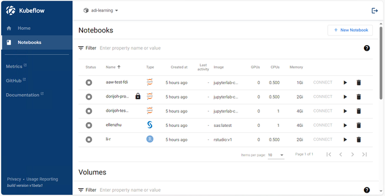
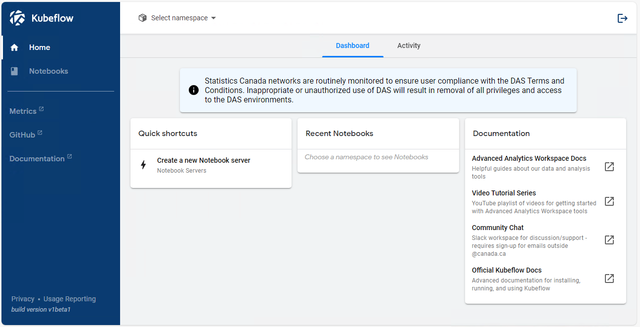

# The Advanced Analytics Workspace

The [Advanced Analytics Workspace](https://www.statcan.gc.ca/data-analytics-services/aaw) (AAW) stands as a comprehensive and open-source solution designed to cater to the diverse needs of data scientists, analysts, and researchers proficient in open-source tools and coding. It offers a flexible environment that empowers practitioners to seamlessly conduct their work. More information about the AAW and Data Analytics Services (DAS) can be found on [the DAS Portal](https://www.statcan.gc.ca/data-analytics-services/aaw).

## Getting Started

### AVD

The Advanced Analytics Workspace (AAW) runs in the cloud and it's main interface is called Kubeflow. In order to access the AAW, please launch your AVD using the **Remote Desktop** icon on your personal computer.

Once your AVD has started, you can launch the AAW by opening the icon on your desktop. You can also access the AAW by following this link: [https://kubeflow.aaw.cloud.statcan.ca/](https://kubeflow.aaw.cloud.statcan.ca/).

#### Login with Your Statistics Canada Account

You'll need to login using your Statistics Canada account.

### Using the AAW through the Kubeflow Interface

#### Kubeflow Central Dashboard

When you first log in to the AAW, you will see the Kubeflow Central Dashboard. This contains links to recently used Notebook Servers and documentation. 

#### Kubeflow Central Dashboard Sidebar

The sidebar on the left has 

- **Home**: The Kubeflow Central Dashboard.
- **Notebooks**: Manage your notebook servers.
- **Metrics**: Grafana, the AAW's observability platform.
- **Github**: The official Kubeflow Github repository.
- **Documentation**: The official Kubeflow documentation.

As a user of the Advanced Analytics Workspace, you'll only need to use **Home** and **Notebooks**.

## Namespace Selection

When you are on the Kubeflow Central Dashboard, in the upper left corner you will find the **Select namespace** dropdown menu. If the menu says "Select namespace" then you need to select a namespace before you can view, edit or launch any of your notebook servers. 

### Select the namespace from the namespace dropdown menu.

When you select the menu, a dropdown list will appear with all the namespaces you belong to. Please select the appropriate namespace before moving forward.

### If you see the name of a namespace, you are ready to use the AAW.

Once a namespace has been selected, the name of the namespace will replace "Select namespace". If no namespaces appear in the menu, please contact us on the **#general** channel on [Slack](https://statcan-aaw.slack.com).

## Creating a new Notebook Server

### Click **Notebooks** from the sidebar on the left.

Once you click **Notebooks** from the Central Dashboard Sidebar, you will be brought to the Notebooks management section of Kubeflow where you can **Create**, **Start**, **Stop** and **Delete** your notebook servers and storage.

**Note**:  only one set of notebook servers can be viewed at a time. If you have more than one namespace. You may need to select the appropriate namespace from the **Select namespace** dropdown menu in the upper left-hand corner to see the notebook servers belonging to that particular namespace. 

### Click **"+ New Notebook"**

To create a new notebook server, press the **"+ New Notebook"** button in the upper right-hand corner.

## Configure the Notebook Server

### Name your notebook server

The first thing you'll have to do is to name your Notebook Server. You must start the name with a lowercase letter and no spaces.

### Select the notebook server type.

If you need SAS, select SAS, otherwise JupyterLab is suitable for most users. The RStudio image only has RStudio and Ubuntu is a more advanced desktop image for special desktop applications.

### Select Protected B if you need it

Select Protected B if you need it. Your notebook server will not have access to the internet if you do this.

Once your notebook server has been named and you have selected the type of notebook server you can press **LAUNCH**.

#### Need Assistance?

- For more detailed instructions on notebook server creation, please [follow the instructions here](https://statcan.github.io/aaw/en/1-Experiments/Kubeflow.html#setup) to configure the notebook server.
- We also have [a Slideshow](https://docs.google.com/presentation/d/12yTDlbMCmbg0ccdea2h0vwhs5YTa_GHm_3DieG5A-k8/edit?usp=sharing) with instructions on how to create a notebook server.

### Kubeflow Documentation

The AAW is based on [Kubeflow](https://statcan.github.io/aaw/en/1-Experiments/Kubeflow.html), an open source comprehensive solution for deploying and managing end-to-end ML workflows. Kubeflow simplifies the creation and management of customizable compute environments with user-controlled resource provisioning (custom CPU, GPU, RAM and storage). For more information on Kubeflow, please visit:

- [AAW Kubeflow Documentation](https://statcan.github.io/aaw/en/1-Experiments/Kubeflow.html)
- [Official Kubeflow Documentation](https://www.kubeflow.org/docs/started/introduction/)
    
#### Kubeflow Videos

Videos on Kubeflow have been developed by Google:

- [Kubeflow 101](https://www.youtube.com/playlist?list=PLIivdWyY5sqLS4lN75RPDEyBgTro_YX7x) by Google Cloud Tech

## Working with Your Data

Once your notebook server has been created, you may want to import data or access shared data from cloud storage. Instructions on how to add storage to your notebook server can be found on [the documentation page for storage](https://statcan.github.io/aaw/en/5-Storage/KubeflowVolumes.html).

### Protected Data

If your project requires protected data:

- Cloud storage buckets will be created for you at the time of your projects onboarding.
- Accessing protected data is done by opening the buckets folder, see [the documentation on Azure Blob Storage](https://statcan.github.io/aaw/en/5-Storage/AzureBlobStorage.html).

### Unprotected Data

If you want to upload data into your notebook server ([on a Data Volume](https://statcan.github.io/aaw/en/5-Storage/KubeflowVolumes.html#setup), for instance), you can upload data into JupyterLab by following [the official JupyterLab documentation](https://jupyterlab.readthedocs.io/en/stable/user/files.html#uploading-and-downloading), which has a section on uploading and downloading files from the JupyterLab web interface.

## Working in JupyterLab

Kubeflow creates and manages notebook servers running JupyterLab, which is the main interface in which you'll be doing your data science work.

### Virtual Environments

When conducting data science experiments, it's a best practice to utilize Python and/or conda virtual environments to manage your project dependencies. It is common to create a dedicated environment for each project or, in some cases, separate environments for different features or aspects of your work (for instance, one environment for general projects and an additional environment tailored for GPU-accelerated deep learning tasks).

!!! Info "Virtual Environments and the Launcher"
    If you find yourself frequently switching between environments and desire a more convenient way to access them within JupyterLab, you can follow [these instructions](https://statcan.github.io/aaw/en/1-Experiments/Virtual-Environments.html#creating-and-adding-environments-to-the-jupyterlab-launcher).

### JupyterLab Documentation

- [Official Getting Started with JupyterLab Docs](https://jupyterlab.readthedocs.io/en/stable/getting_started/overview.html)

### Example IPython Notebooks

You can download these notebooks and upload them to your notebook server. These notebooks can also be run from Visual Studio Code if you prefer.

1. [Visual Python: Simplifying Data Analysis for Python Learners](https://statcan.github.io/aaw/en/1-Experiments/Notebooks/VisualPython_EN.html)
2. [YData Profiling: Streamlining Data Analysis](https://statcan.github.io/aaw/en/1-Experiments/Notebooks/YData-Profiling_EN.html)
3. [Draw Data: Creating Synthetic Datasets with Ease](https://statcan.github.io/aaw/en/1-Experiments/Notebooks/DrawData_EN.html)
4. [D-Tale: A Seamless Data Exploration Tool for Python](https://statcan.github.io/aaw/en/1-Experiments/Notebooks/DTale_EN.html)
5. [Mito Sheet: Excel-Like Spreadsheets in JupyterLab](https://statcan.github.io/aaw/en/1-Experiments/Notebooks/MitoSheet_EN.html)
6. [PyGWalker: Simplifying Exploratory Data Analysis with Python](https://statcan.github.io/aaw/en/1-Experiments/Notebooks/PyGWalker_EN.html)
7. [ReRun: Fast and Powerful Multimodal Data Visualization](https://statcan.github.io/aaw/en/1-Experiments/Notebooks/ReRun_EN.html)
8. [SweetViz: Streamlining EDA with Elegant Visualizations](https://statcan.github.io/aaw/en/1-Experiments/Notebooks/SweetViz_EN.html)

## Need Help?

Join our vibrant community! Connect with AAW developers and fellow users, ask questions, and share experiences all on the [Slack Support Channel](https://statcan-aaw.slack.com/).

For comprehensive documentation and guidance, refer to the:

- [AAW Documentation](https://statcan.github.io/aaw/)
- [Official Kubeflow Documentation](https://www.kubeflow.org/docs/)
- [Official JupyterLab Documentation](https://jupyterlab.readthedocs.io/en/stable/user/index.html)

!!! Info "Do you need help?"
    **Need real-time assistance?** Join our [Slack Support Channel](https://statcan-aaw.slack.com).

### Demos and Contributions

For in-depth demos, personalized assistance, or to contribute to the AAW community, reach out to us on [Slack Support Channel](https://statcan-aaw.slack.com). You can contribute to the platform's development and report issues or feature requests on [GitHub](https://github.com/StatCan/aaw).

## External Learning Resources

Some of the AAW Developers are also data scientists! So we have a lot of material to share on data science tooling and best practices. Below are some useful and interested data science learning resources:

### Data Science Resources (R and Python)

- [Machine Learning Mastery's Data Preparation Course](https://machinelearningmastery.com/start-here/#dataprep)
- [A Gentle Introduction to SciKit Learn (Python)](https://machinelearningmastery.com/a-gentle-introduction-to-scikit-learn-a-python-machine-learning-library/)
- [Official SciKit Learn Tutorials](https://scikit-learn.org/stable/tutorial/index.html)
- [How to Handle Imbalanced Datasets](https://machinelearningmastery.com/start-here/#imbalanced)
- [Quarto Themes](https://quarto.org/docs/output-formats/html-themes.html)
- [Tidy Models Resampling Techniques](https://www.tidymodels.org/start/resampling/)
- [EasyStats for R](https://github.com/easystats)
- [EasyStats Model Performance Evaluation Package](https://easystats.github.io/performance/)
- [Tidy Modelling with R](https://www.tmwr.org/)
- [Model evaluation and analysis: the modEvA R package in a nutshell](https://modeva.r-forge.r-project.org/modEvA-tutorial.html)
- [Metrics and scoring: quantifying the quality of predictions](https://scikit-learn.org/stable/modules/model_evaluation.html)

### Python Language Resources

- [Real Python's Introduction to Python](https://realpython.com/learning-paths/python3-introduction/)
- [W3School's Introduction to Python](https://www.w3schools.com/python/python_intro.asp)
- [Google Developers' Introduction to Python](https://developers.google.com/edu/python)
- [Machine Learning Mastery's Python Skills](https://machinelearningmastery.com/start-here/#pythonskills)
- [TechWorld with Nana's Python Tutorial for Beginners](https://www.youtube.com/watch?v=t8pPdKYpowI)

### R Language Resources

- [Videos on R](https://www.youtube.com/playlist?list=PLLOxZwkBK52C6_Nkmp0nFCreLfnfJgUL7)
- [Introduction to R](https://cran.r-project.org/doc/manuals/r-release/R-intro.pdf)
- [R Data Import/Export](https://cran.r-project.org/doc/manuals/r-release/R-data.pdf)
