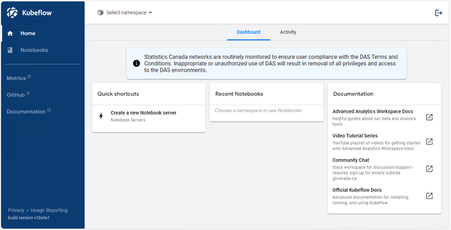

# Documentation L'EAA

Pour des instructions plus détaillées sur la création d'un serveur de bloc-notes, veuillez [suivre les instructions ici](https://statcan.github.io/aaw/en/1-Experiments/Kubeflow.html#setup) pour configurer le serveur de bloc-notes.

Nous avons également [un diaporama](https://054gc-my.sharepoint.com/:p:/g/personal/bryan_paget_statcan_gc_ca/ERkFPxTJwkhNoBKbkCQymqcBoFe2n7PRV0TjLW0KqiJdjQ?e=05Dfg6) avec des instructions sur la façon de créer un serveur de bloc-notes.

## Kubeflow

L'EAA est basé sur [Kubeflow](https://statcan.github.io/aaw/en/1-Experiments/Kubeflow.html), une solution complète open source pour le déploiement et la gestion de workflows ML de bout en bout. Kubeflow simplifie la création et la gestion d'environnements de calcul personnalisables avec un provisionnement de ressources contrôlé par l'utilisateur (CPU, GPU, RAM et stockage personnalisés). Pour plus d’informations sur Kubeflow, veuillez visiter :

- [Documentation l'EAA Kubeflow](https://statcan.github.io/aaw/en/1-Experiments/Kubeflow.html)
- [Documentation officielle Kubeflow](https://www.kubeflow.org/docs/started/introduction/)
    
### Vidéos Kubeflow

Les vidéos sur Kubeflow ont été développées par Google :

- [Kubeflow 101](https://www.youtube.com/playlist?list=PLIivdWyY5sqlS4lN75RPDEyBgTro_YX7x) par Google Cloud Tech

## Travailler avec vos données

Une fois votre serveur de bloc-notes créé, vous souhaiterez peut-être importer des données ou accéder aux données partagées à partir du stockage cloud. Des instructions sur la façon d'ajouter du stockage à votre serveur de bloc-notes sont disponibles sur [la page de documentation pour le stockage](https://statcan.github.io/aaw/en/5-Storage/KubeflowVolumes.html).

Si vous souhaitez télécharger des données sur votre serveur de bloc-notes ([sur un volume de données](https://statcan.github.io/aaw/en/5-Storage/KubeflowVolumes.html#setup), par exemple), vous pouvez télécharger données dans JupyterLab en suivant [la documentation officielle de JupyterLab](https://jupyterlab.readthedocs.io/en/stable/user/files.html#uploading-and-downloading), qui contient une section sur le téléchargement et le téléchargement de fichiers à partir du Interface Web JupyterLab.

### Données protégées

Si votre projet nécessite des données protégées:

- Des buckets de stockage cloud seront créés pour vous au moment de l'intégration de vos projets.
- L'accès aux données protégées se fait en ouvrant le dossier buckets, voir [la documentation sur Azure Blob Storage](https://statcan.github.io/aaw/en/5-Storage/AzureBlobStorage.html).

## JupyterLab

Kubeflow crée et gère des serveurs de bloc-notes exécutant JupyterLab, qui est l'interface principale dans laquelle vous effectuerez votre travail de science des données.

### Documentation JupyterLab

- [Démarrage officiel avec JupyterLab Docs](https://jupyterlab.readthedocs.io/en/stable/getting_started/overview.html)

### Environnements virtuels

Lorsque vous effectuez des expériences de science des données, il est recommandé d'utiliser des environnements virtuels Python et/ou conda pour gérer les dépendances de votre projet. Il est courant de créer un environnement dédié pour chaque projet ou, dans certains cas, des environnements distincts pour différentes fonctionnalités ou aspects de votre travail (par exemple, un environnement pour les projets généraux et un environnement supplémentaire adapté aux tâches d'apprentissage en profondeur accélérées par GPU).

!!! Info "Environnements virtuels et lanceur"
     Si vous passez fréquemment d'un environnement à l'autre et souhaitez un moyen plus pratique d'y accéder dans JupyterLab, vous pouvez suivre [ces instructions](https://statcan.github.io/aaw/en/1-Experiments/Virtual-Environments. html#création-et-ajout-d'environnements-au-lanceur-jupyterlab).

## Exemples de cahiers

Vous pouvez télécharger ces blocs-notes et les télécharger sur votre serveur de blocs-notes. Ces bloc-notes peuvent également être exécutés à partir de Visual Studio Code si vous préférez.

1. [Visual Python : Simplifier l'analyse des données pour les apprenants Python](https://statcan.github.io/aaw/en/1-Experiments/Notebooks/VisualPython_EN.html)
2. [Profilage YData : rationaliser l'analyse des données](https://statcan.github.io/aaw/en/1-Experiments/Notebooks/YData-Profiling_EN.html)
3. [Dessiner des données : créer facilement des ensembles de données synthétiques](https://statcan.github.io/aaw/en/1-Experiments/Notebooks/DrawData_EN.html)
4. [D-Tale : un outil d'exploration de données transparente pour Python](https://statcan.github.io/aaw/en/1-Experiments/Notebooks/DTale_EN.html)
5. [Feuille Mito : feuilles de calcul de type Excel dans JupyterLab](https://statcan.github.io/aaw/en/1-Experiments/Notebooks/MitoSheet_EN.html)
6. [PyGWalker : Simplifier l'analyse exploratoire des données avec Python](https://statcan.github.io/aaw/en/1-Experiments/Notebooks/PyGWalker_EN.html)
7. [ReRun : visualisation de données multimodales rapide et puissante](https://statcan.github.io/aaw/en/1-Experiments/Notebooks/ReRun_EN.html)
8. [SweetViz : Rationaliser l'EDA avec des visualisations élégantes](https://statcan.github.io/aaw/en/1-Experiments/Notebooks/SweetViz_EN.html)