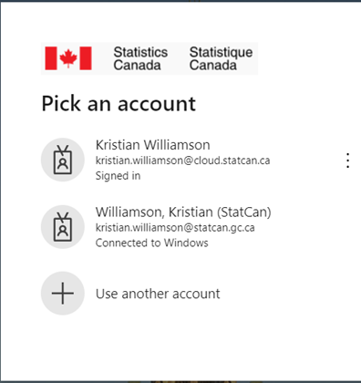
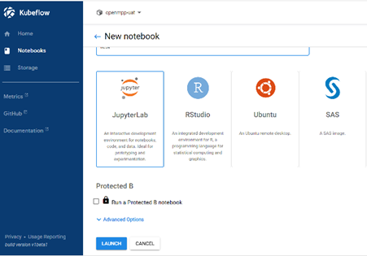
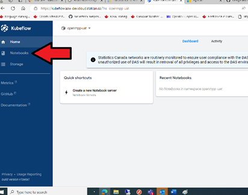
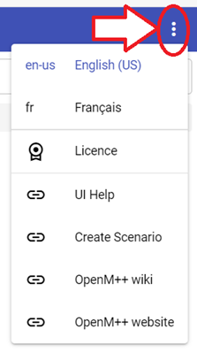
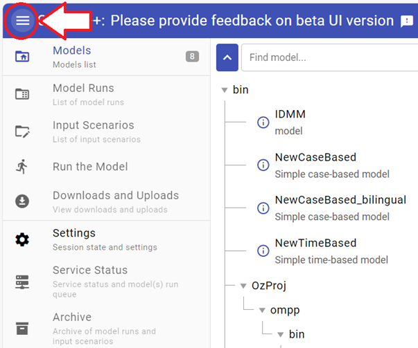
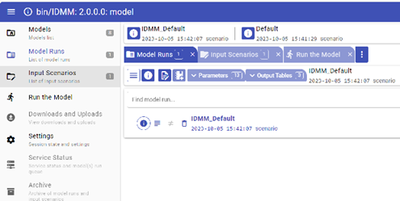
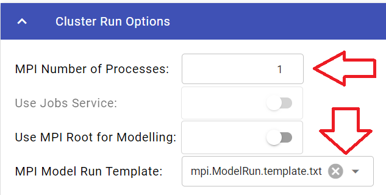
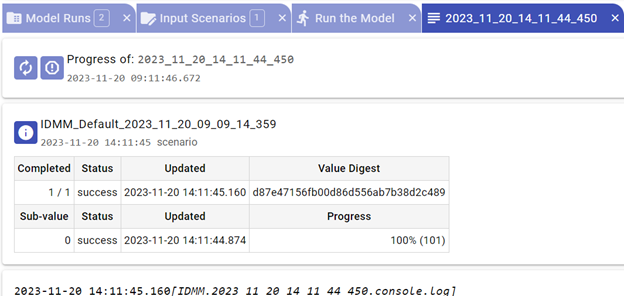

# Premiers pas avec Kubeflow et OpenM++.

Ce document est destiné à servir d'introduction aux Bloc-note de Kubeflow sur la plateforme EAA et à leur utilisation pour le projet OpenM++.

## Démarrage

Pour accéder au portail Kubeflow de l'EAA, accédez au site Web suivant.

[https://kubeflow.aaw-dev.cloud.statcan.ca/](https://kubeflow.aaw-dev.cloud.statcan.ca/)

Cela vous redirigera vers une page de connexion Microsoft.

Sélectionnez le compte que vous souhaitez utiliser et procédez à l'authentification.

Une fois vos informations d'identification authentifiées, vous serez redirigé vers le panneau de gestion Kubeflow de l'EAA.

## Créez un bloc-note.

Cliquez sur le bouton Créer un nouveau serveur bloc-note.

Cela fait apparaître le nouvel écran du bloc-notes.

Pour créer un nouveau carnet, trois éléments doivent être définis :
- Assurez-vous que le bon espace de noms est sélectionné.
- Un nom unique.
- Cliquez ensuite sur le type de carnet souhaité.
   - Pour OpenM++, sélectionnez l'option JupyterLab.
- Si vous travaillez avec des données protégées B, cochez la case **Exécuter dans le bloc-notes protégé B**.

Faites défiler vers le bas pour voir le **Bouton de lancement.** Le bouton de lancement ne sera actif qu'une fois les options ci-dessus sélectionnées.
 

Appuyez sur le bouton Lancer pour lancer votre nouveau bloc-notes.

[Pour plus d'informations sur Kubeflow de l'EAA, cliquez ici.](/aaw/fr/1-Experiences/Kubeflow.html)

### Carnets existants

Si vous avez déjà créé un carnet, vous pouvez le réutiliser en cliquant sur l'onglet Carnets.

Cela fera apparaître une fenêtre avec tous vos blocs-notes existants.

Pour démarrer un ordinateur portable existant, sélectionnez-le et appuyez sur le bouton CONNECT.

Si le **bouton Connecter** est désactivé, cliquez sur le bouton triangle (Démarrer l'image) pour démarrer l'image, puis cliquez sur **connecter** lorsqu'il devient disponible.

## Votre carnet Kubeflow.

Pour démarrer l'interface utilisateur OpenM++, cliquez sur l'icône OpenM++ sur la page bloc-notes.

Cela ouvrira une nouvelle fenêtre avec l'interface utilisateur OpenM++ en cours d'exécution.

## Interface utilisateur OpenM++

Cliquez sur le symbole Ellipses dans le coin supérieur gauche pour changer de langue.

Cliquez sur le menu Hamburger en haut à droite pour ouvrir la barre latérale.

Stockez les modèles et les données dans le bucket de stockage Blob monté sur le bloc-note.

non classé : `/home/jovyan/buckets/aaw-unclassified/microsim/models`
protégé-b : `/home/jovyan/buckets/protected-b/microsim/models`

Les fichiers journaux doivent apparaître sous le répertoire parent « Microsim ».

Veuillez consulter le lien suivant pour plus d'informations sur ce sujet :

[Stockage Azure Blob](/aaw/fr/5-Stockage/StockageBlobAzure.html)

Cliquez sur le modèle souhaité (panneau de gauche) pour le sélectionner.

Cela fait apparaître le panneau d'exécution du modèle et active les onglets Scénarios d'entrée et Exécuter le modèle sur le panneau de droite.

Les onglets horizontaux sont également actifs (mais grisés) à ce moment-là.

Pour exécuter un modèle, vous devez d'abord saisir le nom du modèle. Cliquer dans la zone Nom du modèle générera un nom de modèle horodaté de manière unique pour l'exécution.

Pour exécuter des modèles utilisant le multi-traitement (MPI), les opérations suivantes doivent être effectuées. Cela ne fonctionnera que pour les modèles compatibles MPI.

Dans l'onglet **Options d'exécution du cluster**, assurez-vous que :
- au moins un Processus est sélectionné dans le **MPI Nombre de Processus** et
- le modèle sélectionné dans le **MPI Model Run Template** est : **mpi.ModelRun.template.txt**

Vous pouvez ensuite cliquer sur **Exécuter le modèle** pour exécuter la tâche.

Cela exécutera le modèle et affichera le panneau de résultats de l'exécution du modèle qui affiche les résultats de l'exécution.

