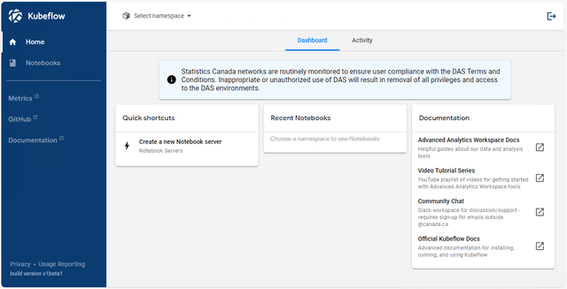

# AAW Documentation

For more detailed instructions on notebook server creation, please [follow the instructions here](/aaw-2.0/aaw/en/1-Experiments/Kubeflow.html#setup) to configure the notebook server.

We also have [a Slideshow](https://054gc-my.sharepoint.com/:p:/g/personal/bryan_paget_statcan_gc_ca/ERkFPxTJwkhNoBKbkCQymqcBoFe2n7PRV0TjLW0KqiJdjQ?e=05Dfg6) with instructions on how to create a notebook server.

## Kubeflow

The AAW is based on [Kubeflow](/aaw-2.0/aaw/en/1-Experiments/Kubeflow.html), an open source comprehensive solution for deploying and managing end-to-end ML workflows. Kubeflow simplifies the creation and management of customizable compute environments with user-controlled resource provisioning (custom CPU, GPU, RAM and storage). For more information on Kubeflow, please visit:

- [AAW Kubeflow Documentation](/aaw-2.0/aaw/en/1-Experiments/Kubeflow.html)
- [Official Kubeflow Documentation](https://www.kubeflow.org/docs/started/introduction/)
    
### Kubeflow Videos

Videos on Kubeflow have been developed by Google:

- [Kubeflow 101](https://www.youtube.com/playlist?list=PLIivdWyY5sqLS4lN75RPDEyBgTro_YX7x) by Google Cloud Tech

## Working with Your Data

Once your notebook server has been created, you may want to import data or access shared data from cloud storage. Instructions on how to add storage to your notebook server can be found on [the documentation page for storage](/aaw-2.0/aaw/en/5-Storage/KubeflowVolumes.html).

If you want to upload data into your notebook server ([on a Data Volume](/aaw-2.0/aaw/en/5-Storage/KubeflowVolumes.html#setup), for instance), you can upload data into JupyterLab by following [the official JupyterLab documentation](https://jupyterlab.readthedocs.io/en/stable/user/files.html#uploading-and-downloading), which has a section on uploading and downloading files from the JupyterLab web interface.

### Field Filers

Under construction...

### Protected Data

If your project requires protected data:

- Cloud storage buckets will be created for you at the time of your projects onboarding.
- Accessing protected data is done by opening the buckets folder, see [the documentation on Azure Blob Storage](/aaw-2.0/aaw/en/5-Storage/AzureBlobStorage.html).

## JupyterLab

Kubeflow creates and manages notebook servers running JupyterLab, which is the main interface in which you'll be doing your data science work.

### JupyterLab Documentation

- [Official Getting Started with JupyterLab Docs](https://jupyterlab.readthedocs.io/en/stable/getting_started/overview.html)

### Virtual Environments

When conducting data science experiments, it's a best practice to utilize Python and/or conda virtual environments to manage your project dependencies. It is common to create a dedicated environment for each project or, in some cases, separate environments for different features or aspects of your work (for instance, one environment for general projects and an additional environment tailored for GPU-accelerated deep learning tasks).

!!! Info "Virtual Environments and the Launcher"
    If you find yourself frequently switching between environments and desire a more convenient way to access them within JupyterLab, you can follow [these instructions](/aaw-2.0/aaw/en/1-Experiments/Virtual-Environments.html#creating-and-adding-environments-to-the-jupyterlab-launcher).

## Example Notebooks

You can download these notebooks and upload them to your notebook server. These notebooks can also be run from Visual Studio Code if you prefer.

1. [Visual Python: Simplifying Data Analysis for Python Learners](/aaw-2.0/aaw/en/1-Experiments/Notebooks/VisualPython_EN.html)
2. [YData Profiling: Streamlining Data Analysis](/aaw-2.0/aaw/en/1-Experiments/Notebooks/YData-Profiling_EN.html)
3. [Draw Data: Creating Synthetic Datasets with Ease](/aaw-2.0/aaw/en/1-Experiments/Notebooks/DrawData_EN.html)
4. [D-Tale: A Seamless Data Exploration Tool for Python](/aaw-2.0/aaw/en/1-Experiments/Notebooks/DTale_EN.html)
5. [Mito Sheet: Excel-Like Spreadsheets in JupyterLab](/aaw-2.0/aaw/en/1-Experiments/Notebooks/MitoSheet_EN.html)
6. [PyGWalker: Simplifying Exploratory Data Analysis with Python](/aaw-2.0/aaw/en/1-Experiments/Notebooks/PyGWalker_EN.html)
7. [ReRun: Fast and Powerful Multimodal Data Visualization](/aaw-2.0/aaw/en/1-Experiments/Notebooks/ReRun_EN.html)
8. [SweetViz: Streamlining EDA with Elegant Visualizations](/aaw-2.0/aaw/en/1-Experiments/Notebooks/SweetViz_EN.html)
