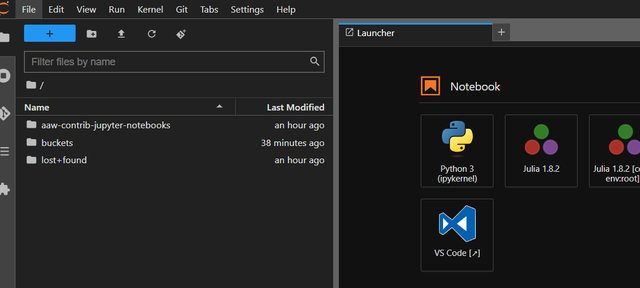
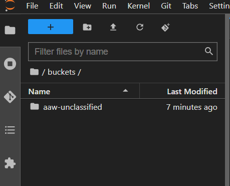
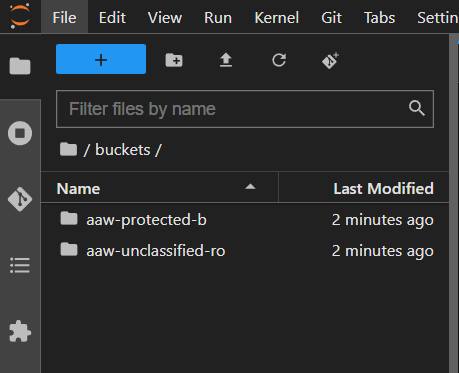

# Azure Blob Storage (Containers)

[Azure Blob Storage](https://learn.microsoft.com/en-us/azure/storage/blobs/storage-blobs-introduction) is Microsoft's object storage solution for the cloud. Blob Storage is optimized for storing massive amounts of unstructured data. Unstructured data is data that doesn't adhere to a particular data model or definition, such as text or binary data.

Azure Blob Storage Containers have the following advantages over Kubeflow Volumes (Disks):

1. **Capacity:** Containers can be huge: way bigger than hard drives. And they are still fast.
2. **Simultaneity:** You can access the same data source from multiple Notebook Servers and pipelines at the same time without needing to duplicate the data.
3. **Shareability:** Project namespaces can share a container. This is great for sharing data with people outside of your workspace.
  
<!-- prettier-ignore -->
!!! warning "Azure Blob Storage containers and buckets have replaced MinIO storage and buckets."
    Users will be responsible for migrating data from MinIO Buckets to the Azure Storage folders. [Click here for instructions on how to migrate!](#how-to-migrate-from-minio-to-azure-blob-storage). For larger files, users may contact their divisional reps.

## Setup

### Accessing Blob Container from JupyterLab

The Blob CSI volumes are persisted under `~/buckets` when creating a Notebook Server. Files under `~/buckets` are backed by Blob storage. All AAW notebooks will have the `~/buckets` mounted to the file-system, making data accessible from everywhere.

These folders can be used like any other - you can copy files to/from using the file browser, write from Python/R, etc. The only difference is that the data is being stored in the Blob storage container rather than on a local disk (and is thus accessible wherever you can access your Kubeflow notebook).



#### Unclassified Containers

Unclassified blob storage containers will appear as follows in the `~/buckets` folder.



#### Protected B Containers

Protected B blob storage containers will appear as follows in the `~/buckets` folder.



### Container Types

The following Blob containers are available. Accessing all Blob containers is the same. The difference between containers is the storage type behind them:

- **aaw-unclassified:** By default, use this one to store unclassified data.
- **aaw-protected-b:** Use this one to store sensitive, Protected B data.
- **aaw-unclassified-ro:** This classification is Protected B but read-only access. This is so users can view unclassified data within a Protected B notebook.

### Accessing Internal Data

Accessing internal data uses the DAS common storage connection which has use for internal and external users that require access to unclassified or Protected B data. The following containers can be provisioned:

- **external-unclassified:** Unclassified and accessible by both StatCan and non-Statcan employees.
- **external-protected-b:** Protected B and accessible by both StatCan and non-StatCan employees.
- **internal-unclassified:** Unclassified and accessible by Statcan employees, only.
- **internal-protected-b:** Protected B and accessible by StatCan employees, only.

The above containers follow the same convention as the AAW containers in terms of data, however there is a layer of isolation between StatCan employees and non-StatCan employees. Non-Statcan employees are only allowed in **external** containers, while StatCan employees can have access to any container. 

AAW has an integration with the FAIR Data Infrastructure team that allows users to transfer unclassified and Protected B data to Azure Storage Accounts, thus allowing users to access this data from Notebook Servers.

Please reach out to the FAIR Data Infrastructure team if you have a use case for this data.

## Pricing

<!-- prettier-ignore -->
!!! info "Pricing models are based on CPU and Memory usage"
    Pricing is covered by KubeCost for user namespaces (In Kubeflow at the bottom of the Notebooks tab).

In general, Blob Storage is much cheaper than [Azure Manage Disks](https://azure.microsoft.com/en-us/pricing/details/managed-disks/) and has better I/O than managed SSD.

## The Azure Storage Explorer

Our friends over at the Collaborative Analytics Environment (CAE) have some documentation on accessing your Azure Blob Storage from your AVD using the [Azure Storage Explorer](https://statcan.github.io/cae-eac/en/AzureStorageExplorer/).

## How to Migrate from MinIO to Azure Blob Storage

First, `source` the environmental variables stored in your secrets vault. You will either `source` from **minio-gateway** or **fdi-gateway** depending on where your data was ingested:

```
source /vault/secrets/fdi-gateway-protected-b
```

Then you create an alias to access your data:

```
mc alias set minio $MINIO_URL $MINIO_ACCESS_KEY $MINIO_SECRET_KEY
```

List the contents of your data folder with `mc ls`:

```
mc ls minio
```

Finally, copy your MinIO data into your Azure Blob Storage directory with `mc cp --recursive`:

```
mc cp --recursive minio ~/buckets/aaw-unclassified
```

If you have Protected B data, you can copy your data into the Protected B bucket:

```
mc cp --recursive minio ~/buckets/aaw-protected-b
```
