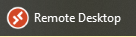
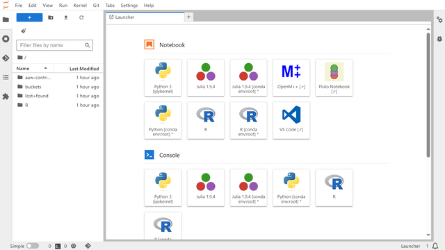

# Business Transformation Interim Solution 1

The Business Transformation Interim Solution 1, based on the [Advanced Analytics Workspace (AAW)](https://www.statcan.gc.ca/data-analytics-services/aaw), stands as a comprehensive and open-source solution designed to cater to the diverse needs of data scientists, analysts, and researchers proficient in open-source tools and coding. It offers a flexible environment that empowers practitioners to seamlessly conduct their work. More information about the AAW and Data Analytics Services (DAS) can be found on [the DAS Portal](https://www.statcan.gc.ca/data-analytics-services/aaw).

## AVD

The Advanced Analytics Workspace (AAW) runs in the cloud and its main interface is called Kubeflow. In order to access the AAW, please launch your AVD using the **Remote Desktop** icon on your personal computer.

Once your AVD has started, you can launch the AAW by opening the icon on your desktop. You can also access the AAW by following this link: [https://kubeflow.aaw.cloud.statcan.ca/](https://kubeflow.aaw.cloud.statcan.ca/).

# Login with Your Statistics Canada Account

You'll need to login using your Statistics Canada account.

# Using the AAW through the Kubeflow Interface

## Kubeflow Central Dashboard

When you first log in to the AAW, you will see the Kubeflow Central Dashboard. This contains links to recently used Notebook Servers and documentation.

## Kubeflow Central Dashboard Sidebar

The sidebar on the left has 

- **Home**: The Kubeflow Central Dashboard.
- **Notebooks**: Manage your notebook servers.
- **Metrics**: Grafana, the AAW's observability platform.
- **Github**: The official Kubeflow Github repository.
- **Documentation**: The official Kubeflow documentation.

As a user of the Advanced Analytics Workspace, you'll only need to use **Home** and **Notebooks**.

# Namespace Selection

When you are on the Kubeflow Central Dashboard, in the upper left corner you will find the **Select namespace** dropdown menu. If the menu says "Select namespace" then you need to select a namespace before you can view, edit or launch any of your notebook servers. 

## Select the namespace from the namespace dropdown menu.

When you select the menu, a dropdown list will appear with all the namespaces you belong to. Please select the appropriate namespace before moving forward.

## If you see the name of a namespace, you are ready to use the AAW.

Once a namespace has been selected, the name of the namespace will replace "Select namespace". If no namespaces appear in the menu, please contact your divisional reps.

# Creating a new Notebook Server

## Click **Notebooks** from the sidebar on the left.

Once you click **Notebooks** from the Central Dashboard Sidebar, you will be brought to the Notebooks management section of Kubeflow where you can **Create**, **Start**, **Stop** and **Delete** your notebook servers and storage.

**Note**:  only one set of notebook servers can be viewed at a time. If you have more than one namespace. You may need to select the appropriate namespace from the **Select namespace** dropdown menu in the upper left-hand corner to see the notebook servers belonging to that particular namespace.  Please consult with your divisional reps if you don't know which namespaces should be selected.

# Click **"+ New Notebook"**

To create a new notebook server, press the **"+ New Notebook"** button in the upper right-hand corner.

# Configure the Notebook Server

## Name

The first thing you'll have to do is to name your Notebook Server. You must start the name with a lowercase letter and no spaces.

# Select the Notebook Server Type

If you don't know which server type to choose, continue reading for a short description of each type.

# JupyterLab

If you don't need access to SAS, then the JupyterLab image is a lighter alternative. The JupyterLab image contains environments for working with R, Python and Julia. 

## Features

The JupterLab Notebook Server has the following features:

- Julia, Python, R programming languages
- Pluto Notebook Environment for Julia
- OpenM++
- VS Code
- Data Analysis with [Pandas](https://pandas.pydata.org/)
- Machine learning with [Tensorflow](https://www.tensorflow.org/), [PyTorch](https://pytorch.org/) and [scikit-learn](https://scikit-learn.org/stable/index.html)
- Data visualization with [Dash](https://dash.plotly.com/), [Plotly](https://plotly.com/python/) and [ggplot2](https://ggplot2.tidyverse.org/)

## Screenshot

Interactive sessions can be started by clicking on any of the icons in the Launcher as seen in the screenshot below.

# SAS

The SAS Notebook Server is the most comprehensive JupyterLab-based Notebook Server. It has more features than the JupyterLab Notebook Server, including its own instance of RStudio. **This is the best option for most people.**

## Features

- Everything in the above JupyterLab Notebook Server
- [SAS language support](https://github.com/sassoftware/sas_kernel)
- SAS Studio
- [SASPy](https://sassoftware.github.io/saspy/)
- RStudio

## Screenshot

Interactive sessions can be started by clicking on any of the icons in the Launcher as seen in the screenshot below.

# RStudio

The RStudio Server is for those who need a lightweight RStudio server without the added weight of the SAS Notebook Server. The RStudio server is not based on JupyterLab.

## Features

The AAW includes some useful R packages by default:

- [Tidyverse](https://www.tidyverse.org/), a set of R packages for data science
- [Tidymodels](https://www.tidymodels.org/), a collection of packages for modeling and machine learning using tidyverse principles
- [Caret](http://topepo.github.io/caret/index.html), short for Classification And REgression Training, is a set of functions that attempt to streamline the process for creating predictive models
- [Quarto](https://quarto.org/), an open-source scientific and technical publishing system

## Screenshot

# Ubuntu

The Ubuntu image is the most advanced server for special desktop applications.

## Features

- PSPP
- QGIS
- VS Code
- OpenM++
- RStudio
- Firefox

## Screenshot

# Protected B

Select Protected B if you need it. Your notebook server will not have access to the internet if you do this.

# Launch

Once your notebook server has been named and you have selected the type of notebook server you can press **LAUNCH**.

