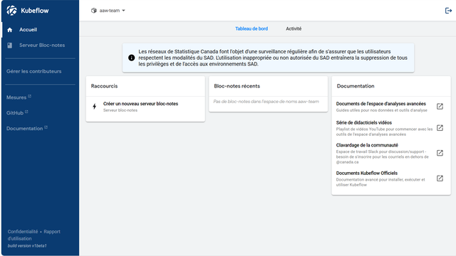
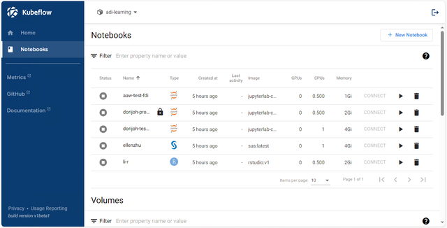
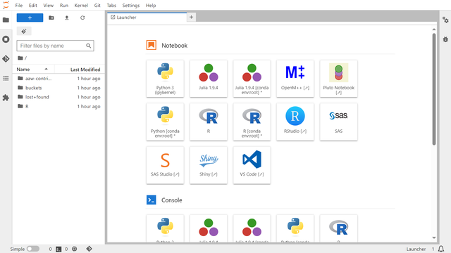
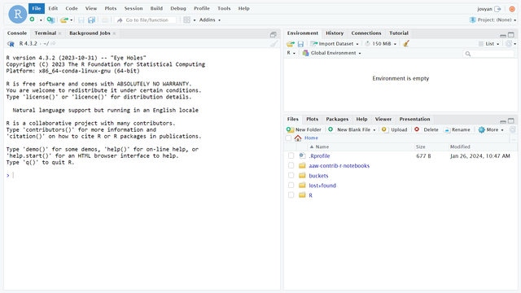

# L'espace de travail d'analyse avancée

L'[Espace de travail d'analyse avancée](https://www.statcan.gc.ca/data-analytics-services/aaw) (AAW) se présente comme une solution complète et open source conçue pour répondre aux divers besoins des scientifiques de données, des analystes et des chercheurs maîtrisant les outils et le codage open source. Il offre un environnement flexible qui permet aux praticiens de mener leur travail en toute transparence. De plus amples renseignements sur l'EAA et les Services d'analyse de données (DAS) sont disponibles sur [le portail DAS](https://www.statcan.gc.ca/data-analytics-services/aaw).

## AVD

L'Espace de travail d'analyse avancée (EAA) s'exécute dans le cloud et son interface principale s'appelle Kubeflow. Pour accéder à l'EAA, veuillez lancer votre AVD à l'aide de l'icône **Remote Desktop** sur votre ordinateur personnel.

Une fois votre AVD démarré, vous pouvez lancer l'EAA en ouvrant l'icône sur votre bureau. Vous pouvez également accéder à l'EAA en suivant ce lien : [https://kubeflow.aaw.cloud.statcan.ca/](https://kubeflow.aaw.cloud.statcan.ca/).

# Connectez-vous avec votre compte Statistique Canada

Vous devrez vous connecter en utilisant votre compte Statistique Canada.

# Utilisation de l'EAA via l'interface Kubeflow

## Tableau de bord central Kubeflow

Lorsque vous vous connectez pour la première fois à l'EAA, vous verrez le tableau de bord central Kubeflow. Celui-ci contient des liens vers des serveurs bloc-notes récemment utilisés et de la documentation.

## Barre latérale du tableau de bord central Kubeflow

La barre latérale de gauche a

- **Accueil** : le tableau de bord central Kubeflow.
- **Serveur Bloc-notes** : gérez vos serveurs de bloc-notes.
- **Mesures** : Grafana, la plateforme d'observabilité de l'EAA.
- **Github** : le référentiel officiel Kubeflow Github.
- **Documentation** : La documentation officielle de Kubeflow.

En tant qu'utilisateur de l'espace de travail Advanced Analytics, vous n'aurez besoin que d'utiliser **Accueil** et **bloc-notes**.

# Sélection d'espace de noms

Lorsque vous êtes sur le tableau de bord central de Kubeflow, dans le coin supérieur gauche, vous trouverez le menu déroulant **Sélectionner l'espace de noms**. Si le menu indique « Sélectionner un espace de noms », vous devez sélectionner un espace de noms avant de pouvoir afficher, modifier ou lancer l'un de vos serveurs de bloc-notes.

## Sélectionnez l'espace de noms dans le menu déroulant de l'espace de noms.

Lorsque vous sélectionnez le menu, une liste déroulante apparaîtra avec tous les espaces de noms auxquels vous appartenez. Veuillez sélectionner l'espace de noms approprié avant de continuer.

## Si vous voyez le nom d'un espace de noms, vous êtes prêt à utiliser l'EAA.

Une fois qu'un espace de noms a été sélectionné, le nom de l'espace de noms remplacera "Sélectionner l'espace de noms". Si aucun espace de noms n'apparaît dans le menu, veuillez nous contacter sur [Jira](https://jirab.statcan.ca/projects/BTIS/issues).

# Création d'un nouveau serveur bloc-notes

## Cliquez sur **bloc-notes** dans la barre latérale de gauche.

Une fois que vous avez cliqué sur **bloc-notes** dans la barre latérale centrale du tableau de bord, vous serez redirigé vers la section de gestion des bloc-notes de Kubeflow où vous pourrez **Créer**, **Démarrer**, **Arrêter** et **Supprimer*. * vos serveurs de bloc-notes et votre stockage.

**Remarque** : un seul ensemble de serveurs de bloc-notes peut être consulté à la fois. Si vous avez plusieurs espaces de noms. Vous devrez peut-être sélectionner l'espace de noms approprié dans le menu déroulant **Sélectionner l'espace de noms** dans le coin supérieur gauche pour voir les serveurs de bloc-notes appartenant à cet espace de noms particulier.

# Cliquez sur **"+ Nouveau bloc-notes"**

Pour créer un nouveau serveur de bloc-notes, appuyez sur le bouton **"+ Nouveau bloc-notes"** dans le coin supérieur droit.

# Configurer le serveur de bloc-notes

## Nom

La première chose que vous devrez faire est de nommer votre serveur bloc-notes. Vous devez commencer le nom par une lettre minuscule et sans espaces.

# Sélectionnez le type de serveur de bloc-notes

Si vous ne savez pas quel type de serveur choisir, continuez à lire pour une brève description de chaque type.

# JupyterLab

Si vous n'avez pas besoin d'accéder à SAS, l'image JupyterLab est une alternative plus légère. L'image JupyterLab contient des environnements permettant de travailler avec R, Python et Julia.

## Caractéristiques

Le serveur bloc-notes JupyterLab présente les fonctionnalités suivantes :

- Langages de programmation Julia, Python, R
- Environnement Pluto bloc-notes pour Julia
- OpenM++
- VS Code
- Analyse de données avec [Pandas](https://pandas.pydata.org/)
- Apprentissage automatique avec [Tensorflow](https://www.tensorflow.org/), [PyTorch](https://pytorch.org/) et [scikit-learn](https://scikit-learn.org/ stable/index.html)
- Visualisation des données avec [Dash](https://dash.plotly.com/), [Plotly](https://plotly.com/python/) et [ggplot2](https://ggplot2.tidyverse.org/)

## Capture d'écran

Les sessions interactives peuvent être démarrées en cliquant sur l'une des icônes du lanceur, comme le montre la capture d'écran ci-dessous.

# SAS

Le serveur de bloc-notes SAS est le serveur bloc-notes basé sur JupyterLab le plus complet. Il possède plus de fonctionnalités que le  serveur de bloc-notes JupyterLab, y compris sa propre instance de RStudio. **C'est la meilleure option pour la plupart des gens.**

## Caractéristiques

- Tout dans le serveur JupyterLab bloc-notes ci-dessus
- [Prise en charge du langage SAS](https://github.com/sassoftware/sas_kernel)
-SAS Studio
- [SASPy](https://sassoftware.github.io/saspy/)
-RStudio

## Capture d'écran

Les sessions interactives peuvent être démarrées en cliquant sur l'une des icônes du lanceur, comme le montre la capture d'écran ci-dessous.

# RStudio

Le serveur RStudio est destiné à ceux qui ont besoin d'un serveur RStudio léger sans le poids supplémentaire du SAS bloc-note Server. Le serveur RStudio n'est pas basé sur JupyterLab.

## Caractéristiques

l'EAA inclut par défaut quelques packages R utiles :

- [Tidyverse](https://www.tidyverse.org/), un ensemble de packages R pour la science des données
- [Tidymodels](https://www.tidymodels.org/), une collection de packages pour la modélisation et l'apprentissage automatique utilisant les principes de Tidyverse
- [Caret](http://topepo.github.io/caret/index.html), abréviation de Classification And REgression Training, est un ensemble de fonctions qui tentent de rationaliser le processus de création de modèles prédictifs.
- [Quarto](https://quarto.org/), un système de publication scientifique et technique open source

## Capture d'écran

# Ubuntu

L'image Ubuntu est le serveur le plus avancé pour les applications de bureau spéciales.

## Caractéristiques

- PSPP
- QGIS
- VS Code
- OpenM++
- RStudio
- Firefox

## Capture d'écran

# Protégé B

Sélectionnez Protégé B si vous en avez besoin. Votre serveur de bloc-notes n'aura pas accès à Internet si vous faites cela.

# Lancement

Une fois que votre serveur de bloc-notes a été nommé et que vous avez sélectionné le type de serveur de bloc-notes, vous pouvez appuyer sur **LAUNCH**.

